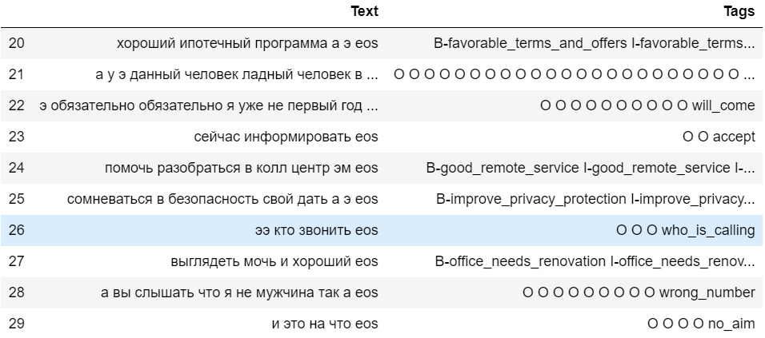

# Проект 2. Задача NER

## Дедлайн

8 декабря 2021, 23:59

## Задача

Вы работаете в компании над разработкой голосового ассистента. Одна из задач для создания такого приложения – это определить слоты или, другими словами, важные фрагменты текста с фактологической информацией для работы вашего ассистента. Ваша задача – создать такой классификатор слотов (NER), используя алгоритмы Deep Learning.

## Данные

Датасет для этого проекта состоит из двух файлов: обучающая выборка, состоящая из пар "фраза-список тэгов", для каждого слова во фразе есть тэг. Если данное слово не является частью слота, то тэг у него O (Other). Второй файл - это тестовая выборка, у которой нет тэгов, а только фразы. Для каждого слова во фразе нужно определить тэг.



Датасет расположен на [Google Drive](https://drive.google.com/drive/folders/1TVssGL7JZiOy4hTwwSRK4xAz3CryM2PH).

Данные, лежащие на Google Drive, можно удобно использовать в рамках работы с Google Colab. Там можно примонтировать свое пространство, снова добавив себе папку с датасетом на свой Google-диск.

## Проверка

Проверка будет осуществляться автоматическим чекером со [страницы проекта в Личном кабинете](https://lk-dl.newprolab.com/lab/dlproject2s).

Чекер будет читать ваш файл с прогнозом, сравнивать с реальным ответом и выдавать вам скор с другой информацией, полезной для дебага, если скор не посчитался.

#### Куда и как вам нужно положить файл

Чекер будет смотреть в папку `/var/www/upload/` на сервере `de.newprolab.com` и искать файл `ivan.ivanov_project02s.csv`. Вместо `ivan.ivanov` вам нужно подставить свой логин от личного кабинета.

Поскольку вычисления у вас будут происходить в одном месте, а проверка файла будет происходить в другом месте, то вам нужно этот файл как-то отправить. Сделать это можно следующим образом:

```bash
$ curl --user upload:newprolabupload -T ivan.ivanov_project02s.csv 'http://de.newprolab.com/upload/' -vvv
```

Следите за кодом ответа, который вы получите в рамках этого запроса:

- код 201 – означает, что файл создан на удаленном сервере
- код 100 – означает, что файл обновлен на удаленном сервере

#### Метрика и порог

Вам нужно преодолеть порог `0.93` для метрики `f1-macro`, чтобы проект был защитан. При рассчете f1-macro не учитывается класс 'O' для объективности оценки.
Реализовывается метрика для NER очень просто: предикты, как и истинные ответы, вытягиваются в один длинный список из сущностей, далее эти два списка сравниваются через sklearn.metrics.f1_score.

#### Решение

Для того чтобы проект был полностью засчитан, вам нужно после дедлайна выложить свое решение в наш общий репозиторий программы, в папку `solutions/project02s` в подпапку с названием с вашим логином `ivan.ivanov`. 

1. Скопируйте себе репозиторий (git clone ...)
2. Создайте свою подпапку.
3. Добавьте туда свои файлы.
4. Далее выполните команды:

```
$ git pull
$ git add .
$ git commit -m "Solution of ivan.ivanov"
$ git push
```

Вы сможете в результате после дедлайна посмотреть, как решали эту же задачу другие ребята. Сразу задумывайтесь о том, чтобы писать хороший код, который удобно читать другим.
