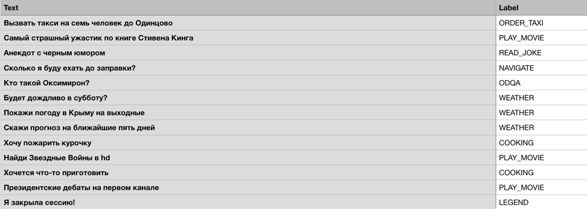

# Проект 2. Классификация интентов

## Дедлайн

8 декабря 2021, пн, 23:59

## Задача

Вы работаете в компании над разработкой голосового ассистента. Одна из задач для создания такого приложения – это автоматическое определение того, что хочет пользователь от приложения, то есть перевести человеческий язык (фраза) в конкретную функцию этого приложения (интент). Ваша задача – создать такой классификатор интентов, используя алгоритмы Deep Learning.

## Данные

Датасет для этого проекта состоит из двух файлов: обучающая выборка, состоящая из пар "фраза-интент" и тестовая выборка, по которой нет интентов, но нужно получить прогноз.



Датасет расположен на [Google Drive](https://drive.google.com/open?id=1b0eG2J3g9DIl0F4oTB4CPqOgscBXufDA).

Данные, лежащие на Google Drive, можно удобно использовать в рамках работы с Google Colab. Там можно примонтировать свое пространство, снова добавив себе папку с датасетом на свой Google-диск.

## Проверка

Проверка будет осуществляться автоматическим чекером со [страницы проекта в Личном кабинете](https://lk-dl.newprolab.com/lab/dlproject2).

Чекер будет читать ваш файл с прогнозом, сравнивать с реальным ответом и выдавать вам скор с другой информацией, полезной для дебага, если скор не посчитался.

#### Куда и как вам нужно положить файл

Чекер будет смотреть в папку `/var/www/upload/` на сервере `de.newprolab.com` и искать файл `ivan.ivanov_project02.csv`. Вместо `ivan.ivanov` вам нужно подставить свой логин от личного кабинета.

Поскольку вычисления у вас будут происходить в одном месте, а проверка файла будет происходить в другом месте, то вам нужно этот файл как-то отправить. Сделать это можно следующим образом:

```bash
$ curl --user upload:newprolabupload -T ivan.ivanov_project02.csv 'http://de.newprolab.com/upload/' -vvv
```

Следите за кодом ответа, который вы получите в рамках этого запроса:

- код 201 – означает, что файл создан на удаленном сервере
- код 100 – означает, что файл обновлен на удаленном сервере

#### Метрика и порог

Вам нужно преодолеть порог `0.85` для метрики `accuracy`, чтобы проект был защитан.

#### Решение

Для того чтобы проект был полностью засчитан, вам нужно после дедлайна выложить свое решение в наш общий репозиторий программы, в папку `solutions/project02` в подпапку с названием с вашим логином `ivan.ivanov`. 

1. Скопируйте себе репозиторий (git clone ...)
2. Создайте свою подпапку.
3. Добавьте туда свои файлы.
4. Далее выполните команды:

```
$ git pull
$ git add .
$ git commit -m "Solution of ivan.ivanov"
$ git push
```

Вы сможете в результате после дедлайна посмотреть, как решали эту же задачу другие ребята. Сразу задумывайтесь о том, чтобы писать хороший код, который удобно читать другим.
